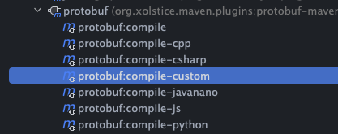

# Method 1

## 1. install protobuf

```
brew install protobuf
```

## 2. generate code with proto file
```
protoc --java_out=./ helloworld.proto
```

## 3. install protoc-gen-grpc-java
```
install protoc-gen-grpc-java from meven: 
    https://repo.maven.apache.org/maven2/io/grpc/protoc-gen-grpc-java/
download your version:
    like:  protoc-gen-grpc-java-1.64.0-osx-aarch_64.exe
```

## 4. chmod
need to set executable permissions
```
chmod +x protoc-gen-grpc-java-1.64.0-osx-aarch_64.exe
```

## 5. generate grpc service class
```
 protoc --plugin=protoc-gen-grpc-java=/your-path/protoc-gen-grpc-java-1.64.0-osx-aarch_64.exe --grpc-java_out=./ helloworld.proto
```

# Method 2   ✅

## 1. add dependencies
```XML
<dependencies>
    <dependency>
        <groupId>io.grpc</groupId>
        <artifactId>grpc-netty-shaded</artifactId>
        <version>1.64.0</version>
        <scope>runtime</scope>
    </dependency>
    <dependency>
        <groupId>io.grpc</groupId>
        <artifactId>grpc-protobuf</artifactId>
        <version>1.64.0</version>
    </dependency>
    <dependency>
        <groupId>io.grpc</groupId>
        <artifactId>grpc-stub</artifactId>
        <version>1.64.0</version>
    </dependency>
    <dependency> <!-- necessary for Java 9+ -->
        <groupId>org.apache.tomcat</groupId>
        <artifactId>annotations-api</artifactId>
        <version>6.0.53</version>
        <scope>provided</scope>
    </dependency>
</dependencies>
```

## 2. add plugin
```XML
<plugin>
<groupId>org.xolstice.maven.plugins</groupId>
<artifactId>protobuf-maven-plugin</artifactId>
<version>0.6.1</version>
<configuration>
    <protocArtifact>com.google.protobuf:protoc:3.25.1:exe:${os.detected.classifier}</protocArtifact>
    <pluginId>grpc-java</pluginId>
    <pluginArtifact>io.grpc:protoc-gen-grpc-java:1.64.0:exe:${os.detected.classifier}</pluginArtifact>
<!--                    <outputDirectory>${project.basedir}/src/main/java</outputDirectory>-->
</configuration>
<executions>
    <execution>
        <goals>
            <goal>compile</goal>
            <goal>compile-custom</goal>
        </goals>
    </execution>
</executions>
</plugin>

```

## 3. generate code with proto file
1.run protobuf compile
2.run protobuf compile-custom

