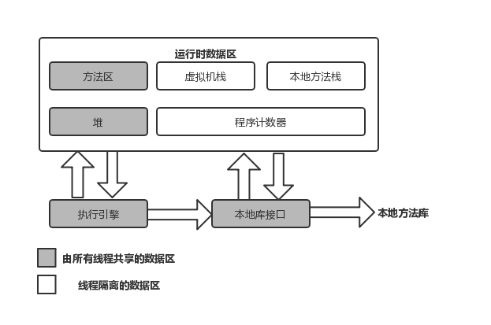

# 深入理解Java虚拟机

## 走近Java

### 1. JVM现状

#### 当前环境下Java的劣势

在**微服务架构**的视角下，有了高可用的服务集群，也就无需追求单个服务7*24小时运行，反而因为Java的启动时间相对较长，需要预热才能达到最高性能等特点就显得有悖于这样的应用场景。
比起服务，一个函数的规模通常会更小，执行时间更短，当前最热门的无服务运行环境AWS Lambda 所允许的最长运行时间仅有15分钟。

#### Java的提前编译

**提前编译(Ahead of Time Compilation ATO)**是相对于即时编译的概念。
提前编译能带来的最大好处是Java虚拟机加载这些已经编译成二进制库之后就能够直接调用，而无需等待即时编译器在运行时将其编译成二进制机器码。理论上，提前编译可以减少即时编译带来的预热时间。
但是提前编译的坏处也很明显，它破坏了Java “一次编写，到处运行”的承诺，必须为不同的硬件、操作系统编译对应的发行包，必须要求加载的代码在编译期就是全部已知的，而不能在运行期才确定，否则就只能舍弃掉已经提前编译好的版本

#### Substrate VM
Substrate VM 是在Graal VM 0.20版本里出现的一个**极小型的运行时环境**，包括了独立的议程处理、同步调度、线程管理、内存管理(垃圾回收)和JNI访问等组件，目标是替代HotSpot来支持提前编译后的程序执行。它还包含了一个本地镜像的构造器(Native Image Generator), 用于为用户程序建立基于Substrate VM的本地运行环境

构造器采用**指针分析(Points-To Analysis)**技术，从用户提供的程序入口出发，搜索所有可达的代码，在搜索的同时，它还执行初始化代码，并在最终生成可执行文件时，将已初始化的堆保存至一个堆快照中。在执行时无需重复进行Java虚拟机的初始化过程。

## 自动内存管理

### 2. Java内存区域与内存溢出异常

#### 运行时数据区域

##### 程序计数器(Program Counter Pegister)
线程私有

程序计数器 是流程控制的指示器，各条线程之间计数器互不影响，独立存储(线程私有)

是唯一一个没有规定任何OutOfMemoryError(OOM)情况的区域

##### Java虚拟机栈(Java Virtual Machine Stack)
线程私有

Java虚拟机栈描述的是Java方法执行的线程内存模型，生命周期与线程相同
每个方法被调用直至执行完毕的过程，就对应着一个栈帧(Stack Frame)在虚拟机栈中从入栈道出栈的过程。
每个方法需要在栈帧中分配多大的局部变量空间是完全确定的，在方法运行期间不会改变局部变量表的大小

如果线程请求的栈的深度大于虚拟机所允许的深度，将抛出**StackOverflowError**
如果Java虚拟机栈容量可以动态扩展(HotSpot栈容量不可以动态扩展)，当栈扩展时无法申请到足够的内存会抛出**OutOfMemoryError**

##### 本地方法栈(Native Method Stack)
线程私有

本地方法栈与Java虚拟机栈所发挥的作用非常相似，区别只是虚拟机栈为执行Java方法(也就是字节码)服务，而本地方法栈则是为虚拟机使用到的本地方法(Native)方法服务

与虚拟机栈一样会抛出**StackOverflowError** 和 **OutOfMemoryError**

##### Java堆(Java Heap)
线程共享

Java堆唯一目的就是存放对象实例(所有**对象实例以及数组**都应当在堆上分配)，但是由于逃逸分析技术日渐强大，栈上分配、标量替换优化等手段已导致一些变化。
Java堆是垃圾收集器管理的内存区域，因此也被叫做GC堆(Garbage Collected Heap)。
Java堆可以处于物理上不连续的内存空间中，但在逻辑上应该被视为连续的
Java堆可以扩展，通过参数(-Xmx 和 -Xms设定)

如果堆中没有内存完成实例分配，并且堆也无法扩展时，将抛出 **OutOfMemoryError**

##### 方法区(Method Area)
线程共享

方法区(也叫非堆 Non-Heap)方法取用于存放已被虚拟机加载的类型信息、常量，静态变量、即时编译器编译后的代码缓存等数据。

如果方法区无法满足新的内存分配需求时，将抛出 **OutOfMemoryError**

##### 运行时常量池(Runtime Constant Pool)

运行时常量池是**方法区的一部分**，常量池表(Constant Pool Table)用于存放编译期生成的各种字面量与符号引用
运行期间也可以将新的常量放入池中(String的intern()方法)

当常量池无法再申请到内存时会抛出 **OutOfMemoryError**

##### 直接内存(Direct Memory)

直接内存 ***并不是虚拟机运行时数据区的一部分***，但是被频繁使用，也可能抛出**OutOfMemoryError**
典型 NIO(New Input/Output) 可以使用Native函数库直接分配堆外内存，然后通过Java堆里的DirectByteBuffer对象作为这块内存的引用进行操作，更高效(避免了Java堆与Native堆中来回复制数据)

若内存区域总和大于物理内存限制，会出现**OutOfMemoryError**